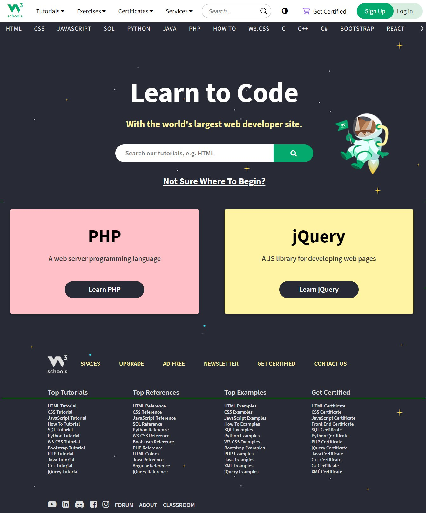
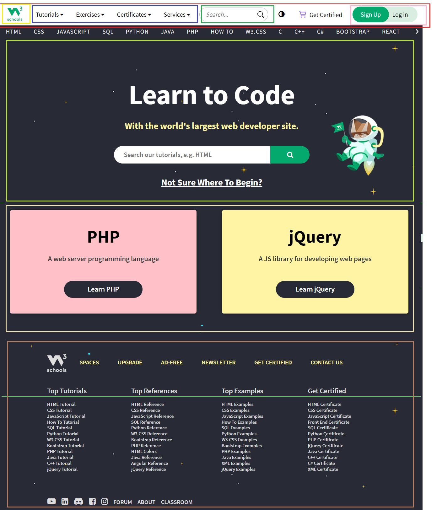

# Copia do W3C com HTML + CSS + Template

## Trabalho:

### Frameworks Frontend

São frameworks web para desenvolvimento de componentes de interface e front-end para sites e aplicações web, usando HTML, CSS e JavaScript, baseado em modelos de design, melhorando a experiência do usuário em um site amigável e responsivo. 

Exemplos:

* Bootstrap <https://getbootstrap.com/> 
* Tailwind CSS <https://tailwindcss.com/> 
* Materialize CSS <https://materializecss.com/> 
* UIkit <https://getuikit.com/> 

### Atividade

Reproduzir layout do site <https://www.w3schools.com/>
utilizando um dos frameworks acima!

* Print do Site w3schools
    

* Divisãode componentes w3schools
    